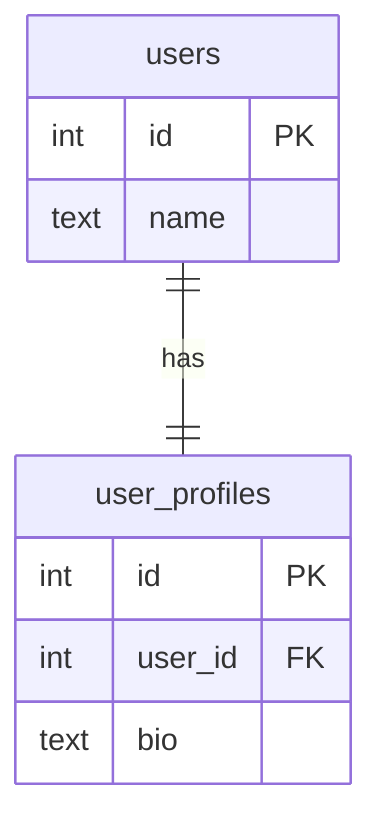
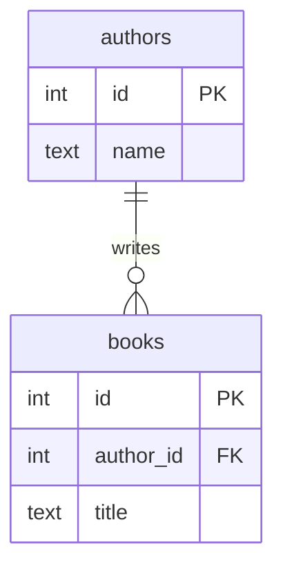

# Quan hệ giữa các bảng trong PostgreSQL

## 1. Quan hệ 1-1 (One-to-One)

Ví dụ thực tế:
- `users` ↔ `user_profiles`
- `users` ↔ `id_cards`

Nơi đặt Foreign Key:
- FK đặt ở bảng chi tiết / phụ thuộc, tức `user_profiles.user_id` (hoặc `id_cards.user_id`).

Tại sao?
- Mỗi `user_profile` chỉ thuộc về một `user`.
- Một `user` có thể có một `profile`.
- Bảng phụ thuộc chứa FK vì nó là bên “nhiều” trong quan hệ 1-1/1-n logic: nó giữ tham chiếu đến bảng chính.
- Nếu `user_profiles` không có `user_id`, không biết profile đó thuộc user nào.

Ví dụ đơn giản:
- `users.id` là PRIMARY KEY.
- `user_profiles.user_id` là FOREIGN KEY và cần UNIQUE để đảm bảo mỗi user chỉ có một profile.

### ER diagram (Mermaid)


---

## 2. Quan hệ 1-N (One-to-Many)

Ví dụ thực tế:
- `authors` → `books`
- `categories` → `products`

Nơi đặt Foreign Key:
- FK đặt ở bảng bên "N" (nhiều), tức `books.author_id`.

Tại sao?
- Mỗi sách (`book`) chỉ có một tác giả (`author`).
- Một tác giả có thể viết nhiều sách.
- Bảng ở phía nhiều cần giữ tham chiếu đến bảng phía một.
- Nếu lưu `author` dưới dạng `TEXT` trong `books`, ta mất liên kết quan hệ, không thể dùng FK, không đảm bảo tính toàn vẹn dữ liệu.

Ví dụ:
- `authors.id` là PRIMARY KEY.
- `books.author_id` là FOREIGN KEY tham chiếu `authors.id`.

### ER diagram (Mermaid)


---

## 3. Quan hệ N-N (Many-to-Many)

Ví dụ thực tế:
- `books` ↔ `categories`
- `students` ↔ `courses`

Tại sao không nối trực tiếp 2 bảng N-N?
- Quan hệ N-N không thể biểu diễn bằng một FK đơn trong một bảng.
- Nếu cố gắng đính nhiều `category_id` vào bảng `books`, ta sẽ lặp dữ liệu và không tuân theo chuẩn hóa.
- Một `book` có thể thuộc nhiều `category`.
- Một `category` có thể có nhiều `book`.

Giải pháp: dùng bảng junction/pivot trung gian.
- Bảng này chứa ít nhất 2 FK: một trỏ đến `books`, một trỏ đến `categories`.
- Bảng pivot cho phép mỗi cặp `book-category` xuất hiện riêng biệt.
- Thường bảng pivot có khóa chính riêng hoặc khóa chính kép (composite PK) để tránh trùng lặp.

### Pivot/Junction chứa gì?
- `book_categories.book_id` FOREIGN KEY → `books.id`
- `book_categories.category_id` FOREIGN KEY → `categories.id`
- Khóa chính thường là `(book_id, category_id)` để đảm bảo mỗi cặp chỉ xuất hiện một lần.
- Có thể thêm cột metadata như `created_at` nếu cần lưu thời điểm liên kết.

### ER diagram (Mermaid)
```mermaid
erDiagram
    books ||--o{ book_categories : contains
    categories ||--o{ book_categories : contains
    books {
        int id PK
        text title
    }
    categories {
        int id PK
        text name
    }
    book_categories {
        int book_id FK
        int category_id FK
        PK(book_id, category_id)
    }
```

---

## Kết luận

1. Quan hệ 1-1: FK nằm ở bảng phụ thuộc, vì bảng này là bên được liên kết đến bảng chính.
2. Quan hệ 1-N: FK nằm ở bảng nhiều, vì mỗi bản ghi nhiều chỉ thuộc về một bản ghi một.
3. Quan hệ N-N: không nối trực tiếp, cần bảng pivot trung gian để biểu diễn cặp tham chiếu.

> Bảng pivot giúp quản lý các mối quan hệ N-N rõ ràng, tránh lặp dữ liệu và cho phép mở rộng thêm thuộc tính liên kết.
