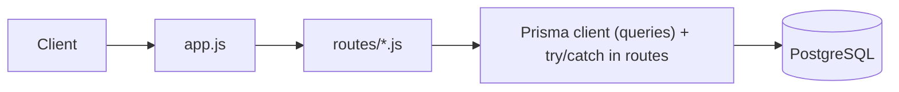

# Architecture audit — Day 8

## 1. Sơ đồ hiện tại

Mermaid:

Tóm tắt tuyến đi của request:

- Client gửi HTTP → `experiments/day8/app.js` (Express)
- `app.js` mount router: `routes/users.js`, `routes/posts.js`
- Router xử lý request, trực tiếp gọi `experiments/day8/lib/prisma.js` (Prisma client) để query
- Router trả response hoặc trả lỗi qua try/catch cục bộ → client

## 2. Code smells (ít nhất 6, kèm path)

1. Route chứa Prisma query (vi phạm tách tầng)
   - Path: `experiments/day8/routes/users.js` — các truy vấn `prisma.user.*` nằm trực tiếp trong route handlers.
   - Path: `experiments/day8/routes/posts.js` — các truy vấn `prisma.post.*` nằm trực tiếp trong route handlers.

2. try/catch copy-paste trong nhiều route
   - Path: `experiments/day8/routes/users.js` — nhiều handler lặp lại pattern `try { await prisma...; res... } catch (error) { res.status(...).json({ error: error.message }) }`.
   - Path: `experiments/day8/routes/posts.js` — cùng pattern lặp lại.

3. Map lỗi Prisma sai status (mapping lỗi không nhất quán)
   - Path: `experiments/day8/routes/users.js` — đôi khi `catch` trả `400`, đôi khi `500`; message lỗi Prisma được trả thẳng cho client.
   - Path: `experiments/day8/routes/posts.js` — tương tự, không phân biệt validation/unique/DB errors => status code không chính xác.

4. Thiếu error-handling middleware so với Day 4
   - Path: `experiments/day8/app.js` — không có centralized error-handling middleware (so sánh với `experiments/day4/modular-server/app.js` có `app.use((err, req, res, next) => ...)`).

5. Prisma client export/adapter đặt trực tiếp ở `lib` nhưng không có wrapper/service
   - Path: `experiments/day8/lib/prisma.js` — xuất thẳng `prisma` và router dùng trực tiếp; thiếu abstraction layer (repository/service) để tách query và xử lý business.

6. Bug cú pháp / accidental characters in routes
   - Path: `experiments/day8/routes/posts.js` — dòng `});x`` ` là lỗi cú pháp/typo trong handler tạo post; cho thấy thiếu test/build step trước merge.

7. Routes trả `res.status(204).send()` cho delete mà không xử lý lỗi không tồn tại nhất quán
   - Path: `experiments/day8/routes/users.js` và `experiments/day8/routes/posts.js` — delete catch trả `400`, không rõ khi record không tồn tại thì trả `404` hay `400`.

8. Thiếu validation/input sanitization ở layer route
   - Path: `experiments/day8/routes/*` — không thấy middleware validate body/params (ví dụ `express-validator` hoặc schema checks).

## 3. Định nghĩa MVC cho REST API (View = JSON)

| Layer | Được làm | Không được làm |
|---|---|---|
| Route | map method/path → controller; parse params/body | gọi Prisma trực tiếp; set status/responses business-specific; chứa business logic |
| Controller | đọc `req`, gọi `service`, trả `res.json()` hoặc next(err) | query DB trực tiếp; gọi `res.status(...)` với logic mapping lỗi từ DB |
| Service | business rules, transaction orchestration, gọi repository/Prisma | truy cập `req`/`res`; gửi HTTP responses |
| Model | định nghĩa schema ( `prisma/schema.prisma` ) và migration | chứa logic HTTP hoặc mapping request |

Ghi chú: ở hệ thống này, hiện tại `routes/*.js` đang kết hợp responsibilities của Route + Controller + Service + Repository (DB access) — cần tách ra.

## 4. Nếu sau này Angular (frontend/) gọi API, thiếu layer nào sẽ làm FE khó bắt lỗi?

Thiếu centralized error-handling + service/controller layer (tách query DB ra khỏi route) sẽ khiến frontend khó phân biệt status code:

- Nếu **routes trả lỗi trực tiếp từ Prisma** (message thô và status không chuẩn), frontend sẽ nhận các HTTP statuses không nhất quán (400/500/200) và không thể quyết định hiển thị lỗi form (400), không tìm (404) hay lỗi server (500).
- Thiếu an chuẩn hóa lỗi (error mapping) ở middleware/controller ⇒ FE không thể phân biệt validation errors (400), not found (404), conflict (409) hay server error (500).

Kết luận: việc thiếu **Controller/Service + centralized error middleware** làm FE khó bắt và xử lý đúng các trường hợp 404 vs 400 vs 500.

## 5. Kế hoạch (plan) để refactor (bạn có thể làm theo để code):

1. Tạo thư mục `experiments/day8/controllers/` và `experiments/day8/services/` (hoặc `lib/services`)
2. Di chuyển logic từ `routes/*.js` vào `controllers/*.js` (controller chỉ: đọc req, gọi service, trả res.json hoặc next(err))
3. Tạo `services/usersService.js` và `services/postsService.js` để chứa business rules và mọi gọi `prisma.*` (repository layer có thể là trực tiếp Prisma hoặc wrapper riêng)
4. Thêm validation middleware (schema check) trước controller (ví dụ `validateCreateUser`, `validateUpdatePost`)
5. Thêm centralized error-handling middleware vào `experiments/day8/app.js` (giống Day 4)
   - middleware này nên inspect error types (Prisma.PrismaClientKnownRequestError, NotFoundError, ValidationError) và map sang { status, body }
6. Chuẩn hóa error mapping: validation → 400, not found → 404, unique/constraint → 409, others → 500
7. Viết unit/integration tests tối thiểu cho create/get/put/delete và chạy lint để bắt typo (fix `posts.js` typo)

## 6. Tài liệu tham khảo nhanh (file liên quan)

- `experiments/day8/app.js`
- `experiments/day8/lib/prisma.js`
- `experiments/day8/routes/users.js`
- `experiments/day8/routes/posts.js`
- `prisma/schema.prisma`
- So sánh: `experiments/day4/modular-server/app.js` (đã có error middleware + 404 handler)

---

Nếu bạn muốn, tôi có thể: (a) tạo skeleton `controllers/` + `services/` và di chuyển một route mẫu (ví dụ `users POST/GET`) — hoặc (b) chỉ tạo `docs`/task list cho bạn. Bạn muốn tôi làm tiếp phần nào?
