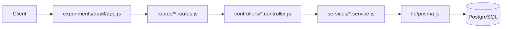

# Day 8 — MVC after refactor

## Diagram (after)



## Example: POST /users — Before / After

Before (in `routes/users.js`):

```js
router.post('/', async (req, res) => {
  try {
    const { name, email } = req.body;
    const user = await prisma.user.create({ data: { name, email } });
    res.status(201).json(user);
  } catch (error) {
    res.status(400).json({ error: error.message });
  }
});
```

After:

```js
// routes/users.routes.js
router.post('/', usersController.create);

// controllers/users.controller.js
export async function create(req, res, next) {
  try {
    const user = await usersService.createUser(req.body);
    res.status(201).json(user);
  } catch (err) { next(err); }
}

// services/users.service.js
export async function createUser(data) {
  return prisma.user.create({ data });
}
```

Benefits: DB logic isolated in services, controllers only map input → service → response, routes only register handlers.
