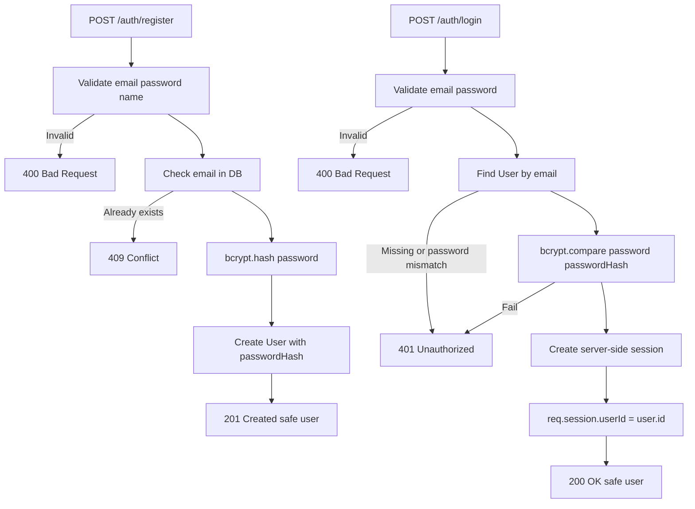

# Auth Flow: Register và Login

Tài liệu này mô tả hai API authentication trên nền MVC Day 8. Password không bao giờ được lưu plain text; database chỉ lưu `passwordHash`.

## `POST /auth/register`

### Request

```http
POST /auth/register
Content-Type: application/json

{
  "email": "alice@example.com",
  "password": "correct horse battery staple",
  "name": "Alice"
}
```

### Logic

```text
1. Validate email, password và name
   -> lỗi input: 400 Bad Request
2. Chuẩn hóa email nếu application policy cho phép, ví dụ trim + lowercase
3. Check DB bằng email
   -> email đã tồn tại: 409 Conflict
4. Hash password bằng bcrypt
5. Create User với email, name và passwordHash
6. Trả user an toàn, không có password/passwordHash
   -> 201 Created
```

### Điều cần check trước khi xử lý

- Email có tồn tại, đúng kiểu và đúng format cơ bản không?
- Password có tồn tại và đạt policy tối thiểu không? Không log password.
- Name có tồn tại và là chuỗi hợp lệ không?
- Email đã có trong DB chưa? Database vẫn phải có unique constraint để chống race condition giữa hai request đăng ký đồng thời.

Hash chỉ xảy ra **sau validation và sau khi kiểm tra email trùng**, để tránh tốn CPU cho input chắc chắn không hợp lệ. Hash vẫn phải được tạo trước khi `create` user.

## `POST /auth/login`

### Request

```http
POST /auth/login
Content-Type: application/json

{
  "email": "alice@example.com",
  "password": "correct horse battery staple"
}
```

### Logic

```text
1. Validate email và password
   -> lỗi input: 400 Bad Request
2. Find User trong DB bằng email
3. Nếu không có user, trả lỗi xác thực chung
   -> 401 Unauthorized
4. Compare password plain với passwordHash bằng bcrypt
5. Nếu compare fail, trả cùng lỗi xác thực chung
   -> 401 Unauthorized
6. Tạo session server-side và gắn req.session.userId
7. Trả user an toàn: id, name, email
   -> 200 OK
```

Không nên trả khác nhau giữa “email không tồn tại” và “sai password”, vì thông báo khác nhau có thể giúp đoán email nào đã đăng ký. Cả hai trường hợp nên dùng cùng status `401` và message chung như `Invalid email or password`.

## Sơ đồ tổng quát



## Bảng status code

| API | Tình huống | Status |
| --- | --- | --- |
| Register | Body thiếu hoặc sai format | `400 Bad Request` |
| Register | Email đã tồn tại | `409 Conflict` |
| Register | Tạo thành công | `201 Created` |
| Login | Body thiếu hoặc sai format | `400 Bad Request` |
| Login | Email không tồn tại hoặc password sai | `401 Unauthorized` |
| Login | Xác thực thành công | `200 OK` |

`401 Unauthorized` ở đây có nghĩa là thông tin xác thực không hợp lệ; không nên tiết lộ cụ thể email hay password nào sai.
